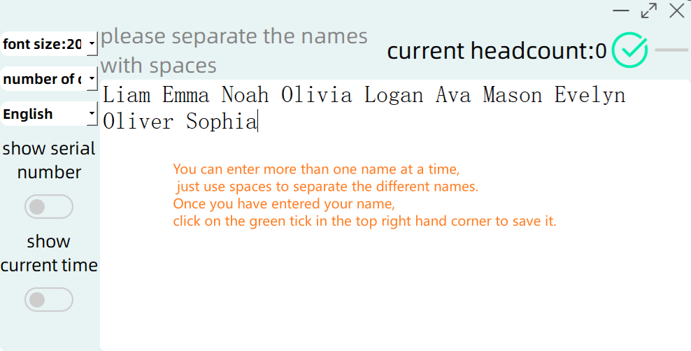
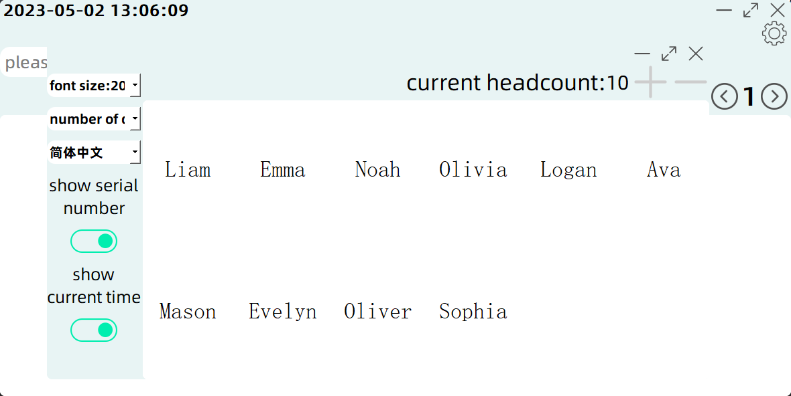

[English](README.md)|[简体中文](README_zh-CN.md)

# LuckyDraw

## `Introduction`

- LuckyDraw is a lightweight and easy to use number drawing program

- Suitable for random selection among multiple people

- Suitable for sample taking

- Suitable for class random selection for handing in assignments ~~The program has slowly evolved from this~~

## Introduction to the interface and features

<h3 align="center">Home page</h3>

The interface has these main functions

##### input box
- What it does: It receives the number entered by the user and extracts the corresponding number from the value saved by the user in the database
- Function: Press the Enter key on the keyboard to extract the corresponding number of values according to the number entered, or press Enter to extract one by default if no number is entered.

##### Extraction button
- Function: As above

##### History drop-down box
- Used to view the extracted history, you can hover over it by sliding the mouse wheel to view the history, you can also click through the mouse to select the history you need to view ~~ personal recommendation to use the first method, more convenient ~~

##### Previous & Next
- Same function as the History drop-down box
- Click the Previous button once to turn the history up one page
- Click the Next button once, the history will go down one page

##### Settings
- Set some configurations for the application

<h3 align="center">Settings page</h3>

<h3 align="center">Add names</h3>

<h3 align="center">Remove names</h3>

<h3 align="center">Show_serial_number--Off</h3>

<h3 align="center">Show_serial_number--On</h3>

<h3 align="center">Show_current_time--Off</h3>

<h3 align="center">Show_current_time--On</h3>

___
