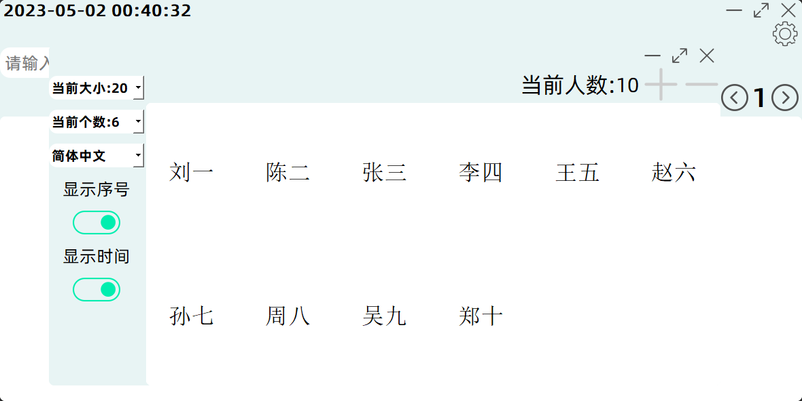

[English](README.md)|[简体中文](README_zh-CN.md)

# LuckyDraw

## **介绍**

- LuckyDraw是一个轻量且易上手的抽号程序

- 适用于多人中随机选择

- 适用于样品抽取(非科学以及专业场景下使用,只是适用于个人使用)

- 适用于班级随机抽取交作业 ~~程序就是从这个慢慢发展起来的~~[下载](https://github.com/wklQnlkm/LuckyDraw/releases/download/v1.0.0/LuckyDraw-Setup.exe)
  看看咯 :)

## 界面及功能介绍

<h3 align="center">主界面</h3>

界面上主要有这几个功能

##### 输入框
- 作用:用于接收用户输入的数字,以从用户保存到数据库里的值里抽取相应的个数
- 功能:按键盘上的回车键可以按照输入的数字抽取相应个数的值,不输入数字按回车默认抽取一个

##### 抽取按钮
- 功能:同上

##### 历史记录下拉框
- 用于查看抽取的历史记录,可以把鼠标悬停在上面通过滑动鼠标滚轮来查看历史记录,也可以通过鼠标点击来选择需要查看的历史记录~~个人建议用第一种方法,比较方便~~

##### 上一页&下一页
- 作用和历史记录下拉框相同
- 点击一次上一页按钮,历史记录往上翻一页
- 点击一次下一页按钮,历史记录往下翻一页

##### 设置
- 设置应用的一些配置

<h3 align="center">设置页面</h3>

<h3 align="center">添加名字</h3>

<h3 align="center">删除名字</h3>

<h3 align="center">显示序号--关</h3>

<h3 align="center">显示序号--开</h3>

<h3 align="center">显示时间--关</h3>

<h3 align="center">显示时间--开</h3>

___

